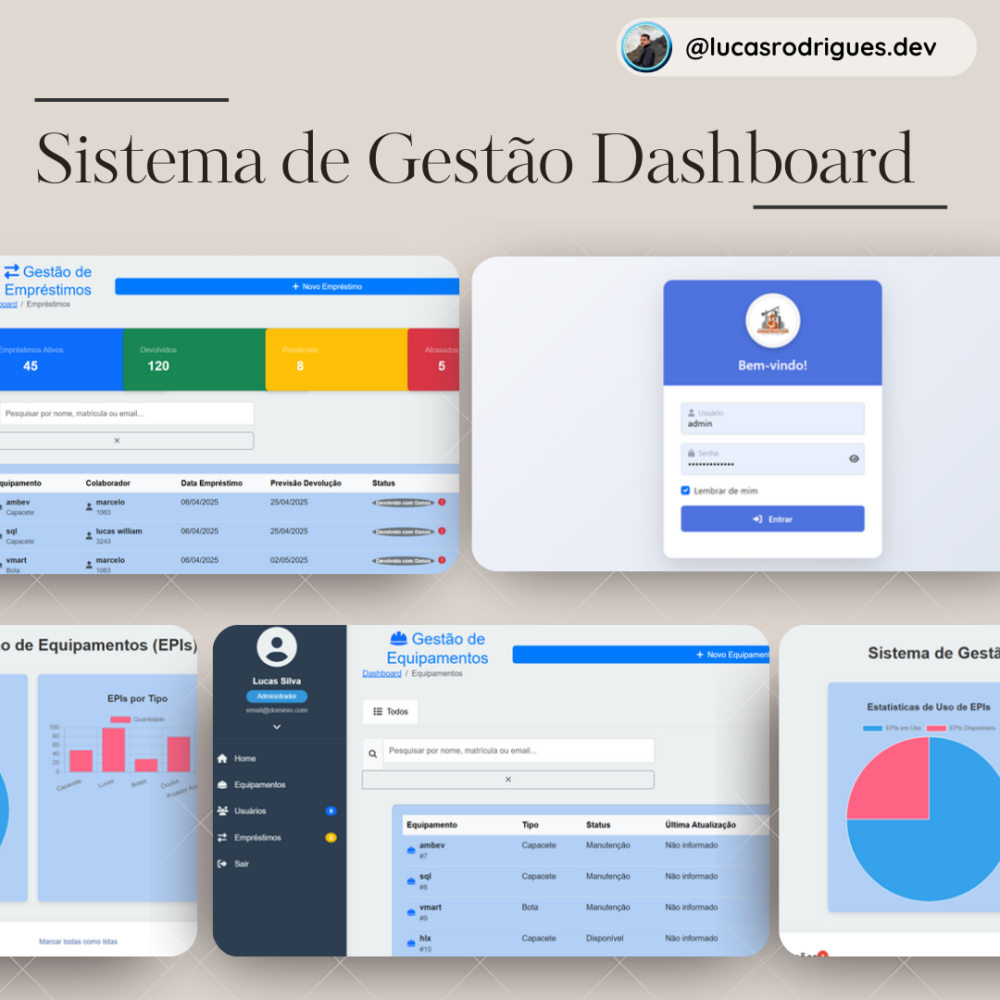

# 👷‍♂️ Sistema de Gerenciamento de EPIs - Construção Civil

> 🛠️ Desenvolvemos um Sistemas para resolver um problema real de gestão de Equipamentos de Proteção Individual (EPIs) em uma construtora.

---

## 📋 Sobre o Projeto

Este sistema tem como objetivo gerenciar de forma eficiente o **empréstimo e devolução de EPIs** para os colaboradores da empresa, garantindo a **segurança no ambiente de trabalho** e a **conformidade com as normas regulamentadoras** (NRs).

---

## 📸 Spoiler do Projeto

> Veja abaixo uma prévia da interface do sistema:

---

## 🎯 Funcionalidades

### ✅ Requisitos Funcionais
- 👤 **Cadastro de Colaboradores**: Nome, função, EPIs obrigatórios.
- 🦺 **Cadastro de EPIs**: Tipo, quantidade, estado de conservação.
- 🔁 **Controle de Empréstimos e Devoluções**: Registro com data/hora e status.
- 👮 **Gerenciamento de Usuários**: Perfis com níveis de permissão (admin/técnico).
- 🔔 **Alertas e Notificações**: Lembretes automáticos sobre uso obrigatório.
- 📊 **Relatórios Gerenciais**: Histórico, estatísticas e conformidade.
- 🔍 **Consulta de Histórico**: Filtros por colaborador, data, EPI.

### ⚙️ Requisitos Não Funcionais
- 💡 **Usabilidade**: Interface intuitiva.
- ⚡ **Desempenho**: Operações rápidas.
- 📈 **Escalabilidade**: Suporte ao crescimento da empresa.
- 🔐 **Segurança**: Dados protegidos contra acessos indevidos.
- 🌐 **Compatibilidade**: Funciona em diferentes dispositivos e navegadores.
- 🛡️ **Confiabilidade**: Alta disponibilidade e tolerância a falhas.

---

## 🧠 Tecnologias Utilizadas

- 💻 **Frontend**: HTML, CSS, JavaScript (jQuery)
- 🐍 **Backend**: Python + Django
- 🗄️ **Banco de Dados**: SQLite
- 🐙 **Controle de Versão**: Git + GitHub
- 🐳 **Containerização**: Docker (com Dockerfile configurado)

---

